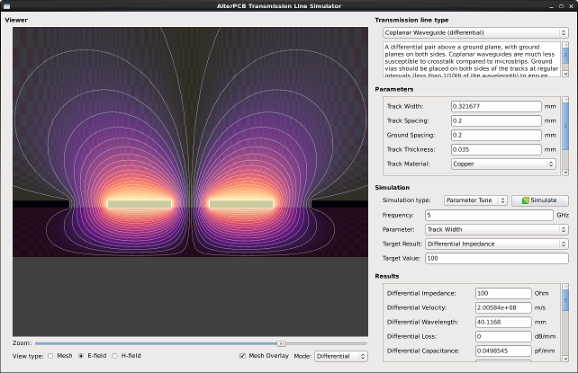

AlterPCB Transmission Line Simulator
====================================

This program is a part of AlterPCB, an open-source, cross-platform PCB design program. AlterPCB is still a work in progress, but since this tool is quite useful by itself, I decided to release it as a stand-alone program.

Note: This project uses Git submodules. You should run the following command to initialize these submodules after cloning this repository:

	git submodule update --init

Features
--------

- Calculates transmission line properties such as characteristic impedance, propagation velocity, wavelength, loss, capacitance, inductance, ...
- Uses an accurate quasi-TEM field solver rather than approximate formulas. As a result it can simulate arbitrary cross sections.
- Includes models for uncommon transmission line types such as differential coplanar waveguides.
- Models optionally include solder mask (which can have a small impact on characteristic impedance and loss).
- Simulates both resistive and dielectric losses (including skin effect and proximity effect).
- Supports anisotropic materials (most PCB substrates such as FR4 are in fact anisotropic).
- Supports single frequency analysis as well as frequency and parameter sweeps.
- Supports automatic parameter tuning (e.g. to determine the track width that will result in an impedance of 50 ohm).
- Straightforward graphical user interface (Qt-based).
- Open-source and cross-platform.

License
-------

GNU GPL v3 - read 'COPYING' for more info.

Dependencies
------------

- Compiler with C++11 support (GCC >= 5.0 or Clang >= 3.3)
- Qt 4 or 5
- Eigen (included as a git submodule)

Compiling and installing
------------------------

Compiling should be done with `cmake` as usual. Installation is not supported yet.
